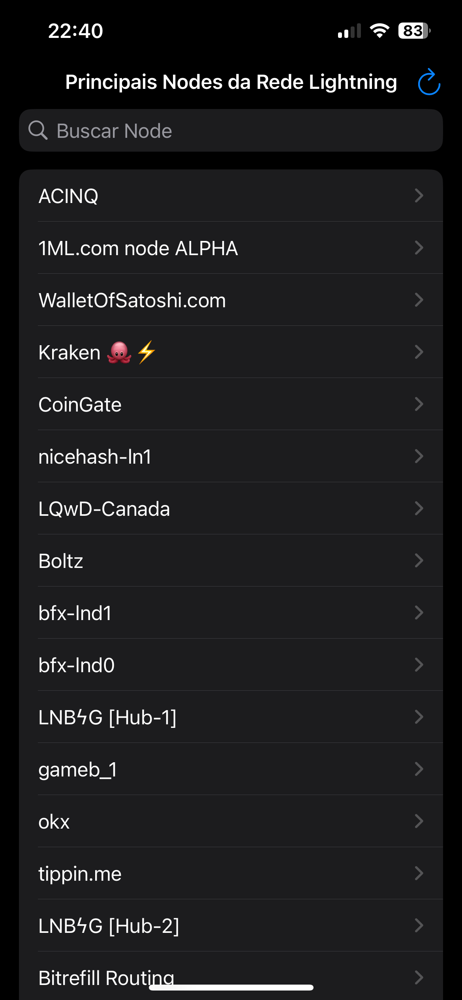
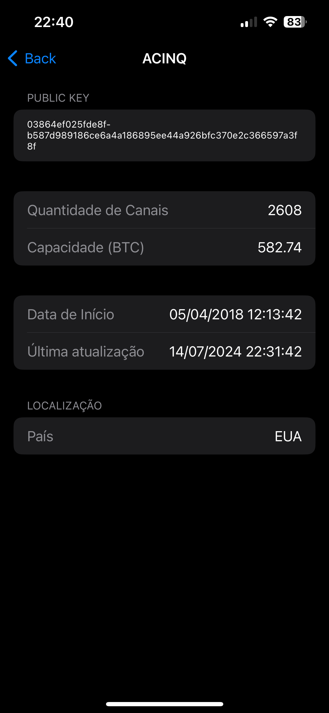

# Crypto-API

## Images
Here are some images of the application:

<table>
  <tr>
    <td></td>
    <td></td>
    <td></td>
  </tr>
</table>

## Build tools & versions used
- SwiftUI

## Requirements
- iOS 17.5 or later

## Steps to run the app
1. Clone the repository from GitHub.
2. Open Xcode.
3. Navigate to the cloned project folder.
4. Open the `.xcodeproj` or `.xcworkspace` file.
5. Connect an iOS device or use the Xcode simulator.
6. Click the "Run" button (or press `Cmd + R`) to build and run the application.

## What areas of the app did you focus on?
- Unit testing
- API requests
- Error handling

## What was the reason for your focus? What problems were you trying to solve?
I focused on these areas to ensure the application was robust and reliable. Unit tests are essential to verify the functionality of the code. API requests were important to ensure data was correctly obtained from external sources. Error handling was necessary to ensure the app could gracefully handle unexpected situations and provide appropriate feedback to users.

## How long did you spend on this project?
- 7 hours

## Did you make any trade-offs for this project? What would you have done differently with more time?
I opted not to focus much on interface improvements due to the limited time. If I had more time, I would have paid more attention to the design and usability of the application to offer a better user experience.
